## important command :
# command 1:

## git init ## 

when you use this command git will create a new folder ( .git ) 
why we need this folder when we do any action in git(add or commit and delete) these logs will be stored in this repo
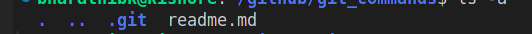

# use ls -a command to view this folder

# command 2:
## git add . ## 

this command is for add the new file into the staging
# what is staging
There are three stages in deploying our files to a GitHub repository. First, we use git add to stage our changes. Second, git commit is used to record the staged changes with a descriptive message. Third, git push uploads the committed changes to GitHub.

For example, imagine you're running a grocery shop (which is like our Git repository). You want to showcase some items (which are like files). Here's how it works: First, you add the items to showcase using git add. After adding them, you need to verify what items are staged. You can do this easily using git status to see the changes you've made.

## command : git status
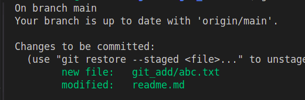

# command 3:
## git commit -m "write about the changes" ##
The -m in git commit -m "message" stands for message. It's used to describe the changes made to a file or the addition of a new file.

Now, let's understand git commit. Imagine you're managing a grocery shop. First, you showcase an item (git add). Then, a customer comes and buys it. However, the item remains in the store until you commit the sale. Similarly, when you use git commit, you're essentially locking in the changes you staged (git add) and telling Git that these changes should be stored in your local repository. Eventually, you'll push them to the GitHub repository.

To continue our analogy, the customer tells you, "Hey Bharathi, I'll send someone to collect these items."

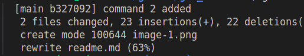

# command 4:

## git push origin -u branch name

Please follow command 1 so that you will understand the concept. Coming to the topic: A customer driver came to my shop and said, 'Hey bro, Customer Name sent to pick up his stuff.' I replied with 'git push origin -u branch_name.' What does this mean? Already, my file is stored in staging 1. Now, I am telling Git, 'Hey Git, this is the file I need to put into my Git repository,' so I am logging the file with the message 'Grocery concept locking the items.' This is staging 2 commit. Git push is staging 3. Now, that driver delivered those items to the end user or customer: the Git repo. I hope you understand the concept."

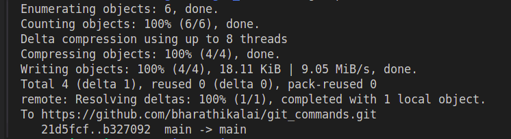

# command 5 

## git branch 

what is git branch ? why we need this ? 
as you all know what is git ? git is a version control application where developer work together and store their code 
story : i am creating a application called food_app its kind or food delivery application i am woking on specfic module like specfic page (home page) my team mets also working on different pages so if everyone working in same branch it will be very defficult to manage their add and commit and push so they need  different branch by using git branch command you can list the all branchs

# command 6

## git branch branch_name  or git branch checkout -b branch_name

follow command 5 so that you will understand the concept 
story: every developers ask me to create a new branch in git so i used this command(git branch ) to create a new branch for them 
story: i have created a new branch for my team mets now  they  asking me bro i want to move to my new branch how to do  i replied please read command 7 

# command 7

## git checkout branch_name

follow command 6 so that you will understand the concept
story: by using this command (git checkout branch_name) you can move to your branch

# command 8 

## git fetch and git pull

follow command 7 so that you will understand the concept
story: one of your team met working on you branch and push his changes to the repo now you want to know what are the changes ha made 
if you use git pull your team met changes will merge  to your local repo you just know to see his changes and no need to merge his changes to your local repo you go with git fetch command
when you do git fetch command git repo latest changes will be stored your local repo but it wont merge with your local repo instead
you can see the changes if you do git pull all the latest changes will be merge your local repo i hope you understand the concept still 
you dont understand please do practice

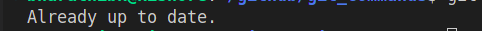

# command 9 

## git log 

please follow command 8 :  one of your team met made some changes in your branch and commit the changes and push it to the git repo 
you asked your team met hay team_met_name  what are the commits you made yesterday he said this that like that now i am thinking if git 
provide any event tracking command that would be very helpfull for us : yes git has the solution that is git log
using git log you can view all the commits 

# command 10

## git reflog

please follow command 9 : i am working on my branch and made lots of commits and add files and delete i did a many action : can i track my actions :  yes you can using git reflog  you can list your git history  
# note:you cant list others action history
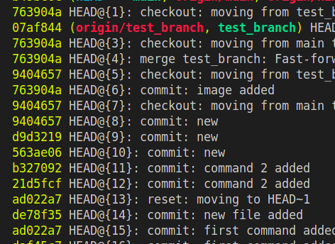

# command 11

## git diff 
uncommit changes you can see by using this command
example: if you have made changes locally  want to check what changes you have made you can use git riff command to view the changes
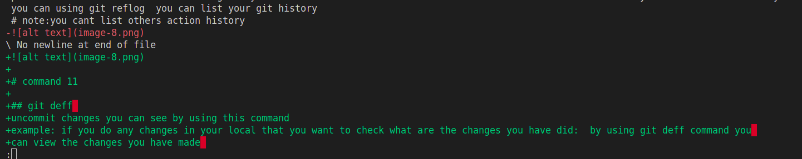

# command 12

## git reset --soft HEAD~1
## git reset --hard HEAD~1

head is nothing but latest commit
~1 mean one step back 
:by using this command you can revert the commit :
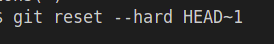
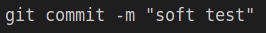

# command 13 
## git revert  commit_id or git checkout commit_id 

example : First, you had Hello World.
Then, you mistakenly changed it to Hello Mars.
Finally, you fixed it back to Hello World.

The git revert command helps you fix mistakes while keeping a record of everything that happened.
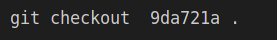

# command 14

## git blame file_name
# Shows what revision and author last modified each line of a file.

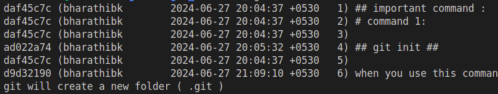

# command 15

## git show commit_id

# The git show command in Git is used to display various types of objects and information, such as:

Commits: It shows the details of a specific commit, including the commit message, author, date, and the changes introduced in that commit.
Tags: It can display the details of a specific tag.
Trees: It can show the contents of a tree object, similar to the output of git ls-tree.
Blobs: It can show the contents of a blob object, similar to the output of git cat-file -p.
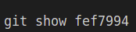

# command 16

## git archive --format=zip HEAD > abc.zip

# by uing this command we can create a zip file with all our git repo file and folders 

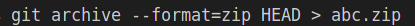

# command 17 

## git config --global user.name "your name"
## git config --global user.email "your mail id"

# the purpose of this command is to set a repo user name 

# command 18

## git clean
using this command you can remove the untracked file for your local repo

# command 19
## git rebase branch_name

git rebase is about keeping your work up-to-date and integrated with the latest changes in the project, resulting in a cleaner and more straightforward project history.

# command 20 
## git stash
## git stash pop

git stash is your secret tool for managing unfinished work in Git, ensuring your creative process stays organized and your project's history remains clean.

# command 21
##  git cherry-pick commit_id
git cherry-pick is a powerful command for selectively bringing individual commits from one branch into another, helping you manage and integrate changes across your Git repository effectively.

# command 22
## git bisect start
## git bisect bad
## git bisect good commit_id

git bisect:
Purpose: Used to perform a binary search through commit history to identify the exact commit that introduced a bug or caused an issue.
Usage: You mark a known "good" state (commit where the bug didn't exist) and a current "bad" state (commit where the bug does exist). Git then systematically checks out commits in between, asking you to test each one until it identifies the problematic commit.

# command 23

## git ls-tree HEAD

git ls-tree: Shows a tree object.

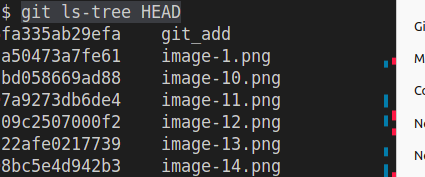